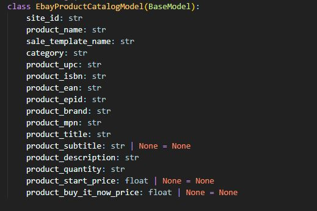
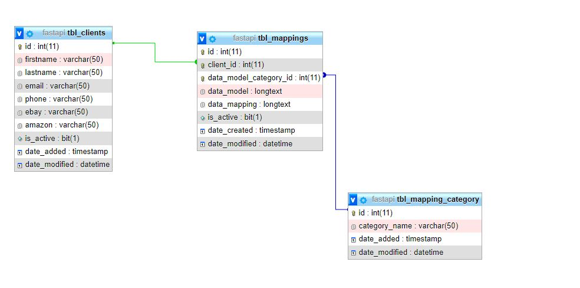
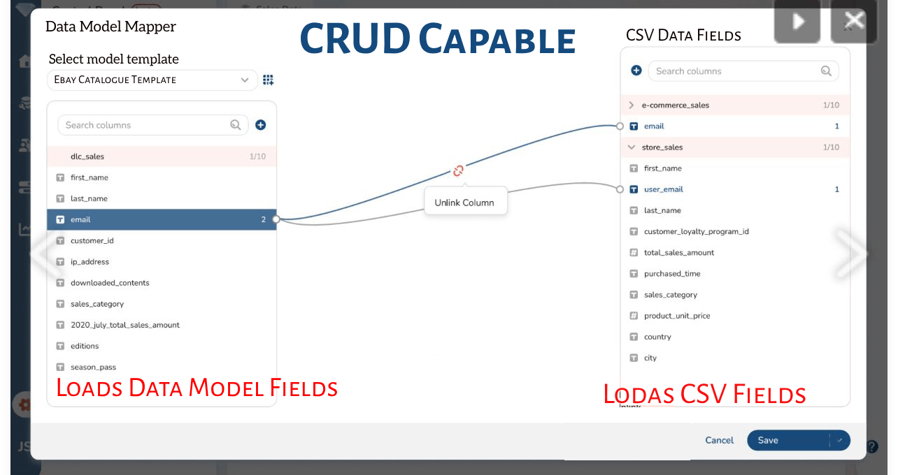

# Data Model Mapping POC
This is a POC to achieve multiple data modeling soucing from different end customers/users/entities/organizations and organize data in a way that is suitable for the destination entities. We have the below entities

# Destination Entities
- Ebay
- Amazon
- Google
  

Google, Ebay and Amazon provide API's to import the products/catalogues. 

AMAZON Marketplace API's
https://docs.developer.amazonservices.com/en_US/dev_guide/DG_IfNew.html

Ebay Marketplace API's
https://developer.ebay.com/develop/apis

Google Merchant Data Feed
https://support.google.com/merchants/answer/7439058?hl=en-GB

# Problem statement
The problem statement is that we receieve the data feeds from different sources and in a different formats. The formats can be CSV, Xlsx etc We need to train our system to map those feeds to suits the requirements of our destination entities.

# POC - Raw Approach:
The manage it, so we can send the correct data to our destination entities, we will map the source data feed. For this purpose we will define different data models. Those will be

**Base DTO Request Model:**  
It will contain the common fields among all the targetted entities.  

And then we will define the sub request models inherited from Base Model as well.   

**Amazon DTO Request Model** (Products, Catalogues, Inventory, Pricing, Reports etc) 
**Ebay DTO Request Model** (Products, Catalogues, Inventory, Pricing, Reports etc) 
**Google DTO Request Model** (Products, Catalogues, Inventory, Pricing, Reports etc) 

**A sample DTO class can be look like as below**   
  

# Database
A database will be there to save the clients mapping information. There will be below tables
  
tbl_clients 
tbl_mapping_catgories (e.g. amazon, ebay, Google and so on)  
tbl_mappings (many to many relationship between clients and their mappings with the mapped information)  

    

# UI in Action
A UI (Web Page / Custom) will be developed to map the receievd data in CSV format with the available marketplace templates. The webpage will allow to Import the CSV and then map their fields with the corresponding data models. 
The sample UI is below

    
  
The mapper UI will provide all the required CRUD operations e.g.
  
Viewing a mapping for a client  
Updating a mapping for a client 
Deleting a mapping for a client 
  

**The mapping inforamtion will be saved in database. I have added like in serialize format or in json format.**

# This will act a mapper layer between the marketplace API's and in house application. This will manage to acknowledge the client feed and to make it suitable for the ebay, Amazon and also Google Merchant feeds. 

**Todo**
A machine learning can also be performed after the system is getting mature to automatically update the mapping for the different feeds of the clients. This is all about the probability.

